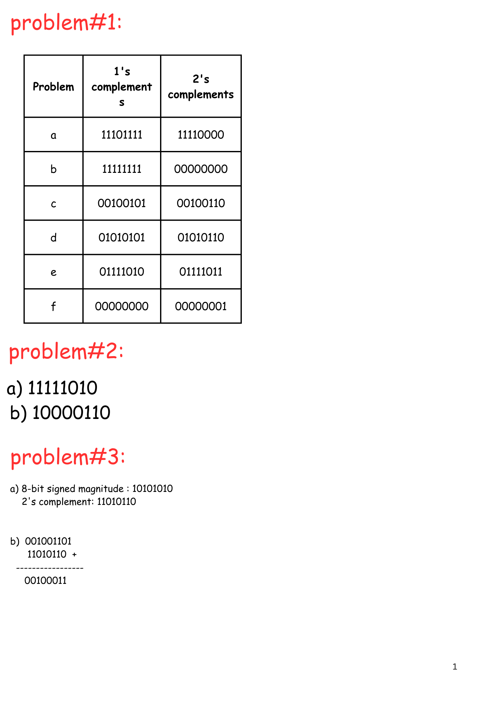

## Problem#1

Obtain the 1’s and 2’s complements of the following binary numbers:
(a) 00010000 (b) 00000000
(c) 11011010 (d) 10101010
(e) 10000101 (f) 11111111.

## Problem#2

Show how the number -122is represented in binary using
a) 8-bit Signed magnitude system
b) 8-bit two’s complement system
Problem#3  
a) Show how this computer represents the number (-42)10in these two
different binary systems (an 8-bit signed magnitude and 8-bit two’s
complement).
b) Show how this computer uses two’s complement arithmetic to add these
numbers in binary (77 + (-42)).

## Problem#4

Draw logic diagrams to implement the following Boolean expression:
a) Y = A + B + B'(A + C')  
c) Y = ( A⊕ C)' + B

## Problem# 5

Draw the truth Table of:
a) A + A’B
b) A’ +B’ + C
c) A(B + AC +A’)
d) AB + AB’ + B’C

## Problem #6

b) Y = C(B⊕ D) + A'
d) Y = (A' + B') (C + D')
Perform subtraction on the given unsigned binary numbers using the 2’s
complement. Where the result should be negative, find its 2’s complement and
affix a minus sign. (suppose numbers are represented in 8 bit)
(a) 10011 - 10010  
(b) 100010 - 100110
(c) 1001 - 110101  
(d) 101000 - 10101

## solve from 1 to 3:

