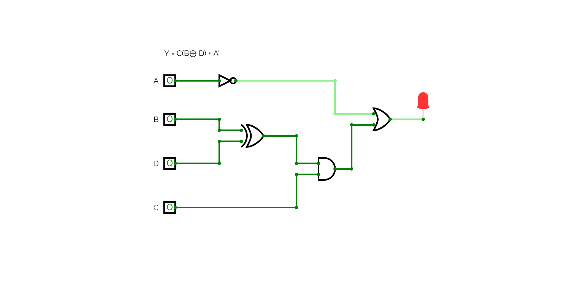

## Problem#1

Obtain the 1’s and 2’s complements of the following binary numbers:
(a) 00010000 (b) 00000000
(c) 11011010 (d) 10101010
(e) 10000101 (f) 11111111.

## Problem#2

Show how the number -122is represented in binary using
a) 8-bit Signed magnitude system
b) 8-bit two’s complement system
Problem#3  
a) Show how this computer represents the number (-42)10in these two
different binary systems (an 8-bit signed magnitude and 8-bit two’s
complement).
b) Show how this computer uses two’s complement arithmetic to add these
numbers in binary (77 + (-42)).

## Problem#4

Draw logic diagrams to implement the following Boolean expression:
a) Y = A + B + B'(A + C')  
b) Y = C(B⊕ D) + A'
c) Y = ( A⊕ C)' + B
d) Y = (A' + B') (C + D')

## solve from 1 to 3:

## solve problem 4

.png>)

👉 [Open Project in CircuitVerse](https://circuitverse.org/simulator/embed/gates_problem4?theme=&display_title=false&clock_time=true&fullscreen=true&zoom_in_out=true)
