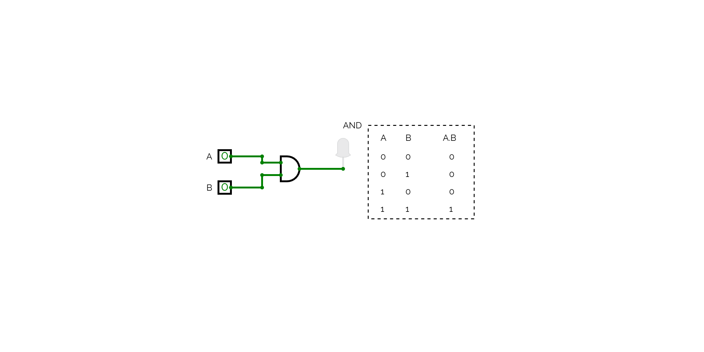
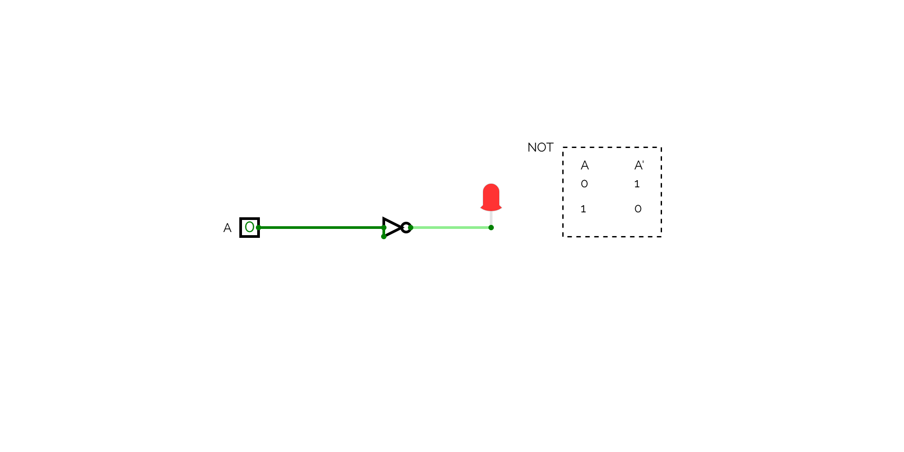
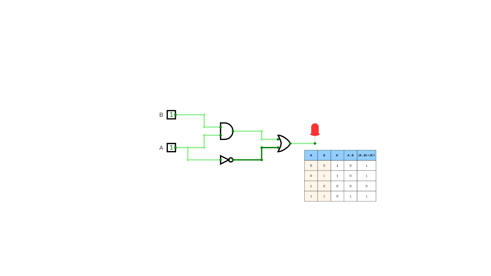

# 🔌 Basic Logic Gates – CircuitVerse

This directory demonstrates the implementation of fundamental logic gates using [CircuitVerse](https://circuitverse.org/), along with a composite logic expression.

## 📁 Included Circuits

1. **AND Gate**
2. **OR Gate**
3. **NOT Gate**
4. **Combined Logic**:  
   \[(A AND B) OR (NOT A)\]
5. **practice dir that contain:
   5.1. 1's and 2's compelments practice
   5.2 gates drawing using CV and their tabels**

---

This demonstrates how basic logic building blocks can be composed to form more complex expressions.

---

## 🖼️ Circuit Screenshots

> All circuits were designed and simulated in CircuitVerse.

### 🔹 AND Gate

### 🔹 OR Gate

.png>)

### 🔹 NOT Gate

### 🔹 Combined Circuit: (A AND B) OR (NOT A)

---

## 🌐 Open in CircuitVerse

You can explore, simulate, and edit the circuit via CircuitVerse here:

👉 [Open Project in CircuitVerse](https://circuitverse.org/simulator/embed/gates-6082249d-0e60-4c5d-8441-c785a2935995?theme=&display_title=false&clock_time=true&fullscreen=true&zoom_in_out=true"=)

---
